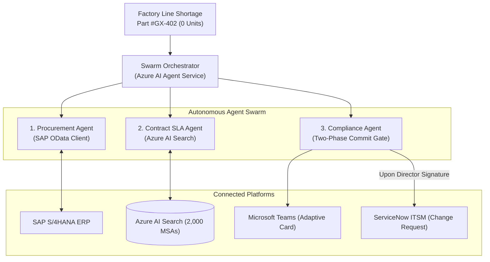
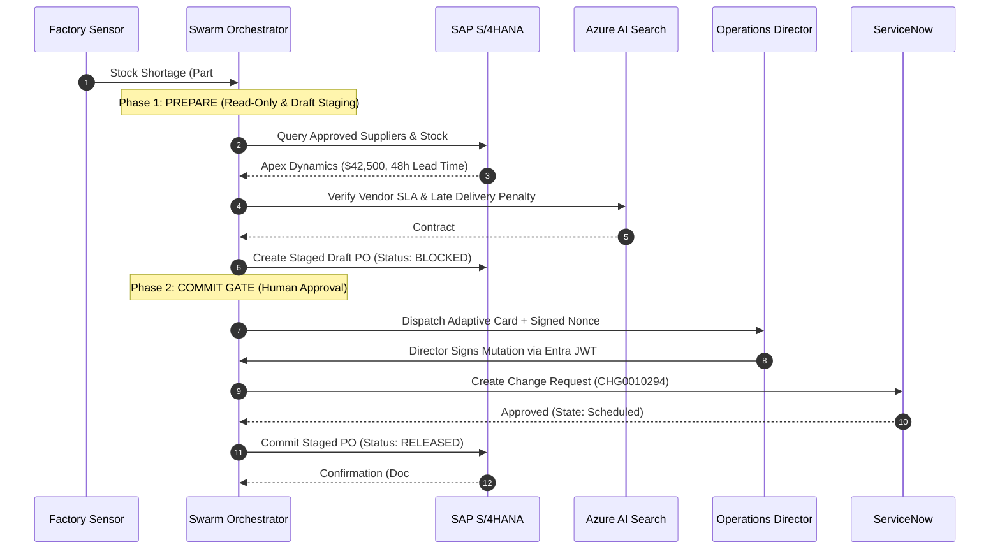

---
title: "Building an Autonomous Multi-Agent ERP Swarm on Azure AI Foundry: Field Notes on Two-Phase Commit and SAP OData"
description: "How to orchestrate an autonomous supply chain agent swarm across SAP S/4HANA, Azure AI Search, and ServiceNow with a cryptographic Two-Phase Commit human approval gate."
pubDate: 2026-08-20
heroImage: "@/assets/blog/azure-ai-foundry-erp-swarm-hero.jpg"
heroAlt: "3D isometric diorama of Azure AI Foundry Multi-Agent Swarm connecting SAP S/4HANA, Azure AI Search, and ServiceNow with Microsoft Teams approval gates."
tags:
  - AI & Agents
  - Microsoft Foundry
  - Security & Identity
  - Azure
topic: "ai-and-agents"
featured: true
---

Most AI agent demos operate in low-stakes environments: summarize a document, draft a message, or mock a toy API call. When attempting to deploy autonomous agent architectures into mission-critical enterprise backbones such as SAP S/4HANA ERP, standard single-turn LLM patterns fail immediately.

In a production supply chain, granting an autonomous agent direct write access to financial or inventory ledgers is an unacceptable risk. A single hallucinated vendor ID or miscalculated purchase quantity can trigger unauthorized multi-thousand-dollar transactions and violate SOX compliance boundaries.

These field notes detail the design and implementation of an Autonomous Multi-Agent Swarm built on Microsoft Azure AI Foundry (Agent Service). The architecture decouples LLM reasoning from transactional state mutation by enforcing a Cryptographic Two-Phase Commit (2PC) Approval Gate through Microsoft Teams and ServiceNow.

---

## Swarm Topology and System Architecture

The swarm divides operational responsibilities across three isolated agents coordinated by the Azure AI Agent Service orchestrator:



### Specialized Swarm Agents

1. **Procurement Agent**: Queries real-time inventory balances from SAP S/4HANA via OData services and stages pending purchase orders in an isolated `DRAFT` state.
2. **Contract SLA Agent**: Performs hybrid vector and semantic search across 2,000 vendor Master Service Agreements (MSAs) in Azure AI Search to verify delivery guarantees and penalty terms.
3. **Compliance and Approval Agent**: Evaluates procurement risk thresholds, generates a cryptographically signed Microsoft Teams Adaptive Card for human sign-off, and records an official ServiceNow Change Request (`CHG0010294`).

---

## The Cryptographic Two-Phase Commit Protocol

To guarantee that no autonomous agent directly executes unvalidated financial mutations, the workflow operates as a two-phase state machine:



### Phase 1 Isolation Requirements

In Phase 1, the AI agent possesses zero write authorization on the live financial ledger. The Purchase Order is created with an explicit lock state (`BLOCKED_FOR_APPROVAL`). The ERP database rejects automated dispatch until Phase 2 verifies a valid HMAC nonce signed by the Operations Director.

---

## Step-by-Step Implementation

### 1. Passwordless Azure AI Foundry Initialization

Authentication uses Microsoft Entra Managed Identities rather than static connection strings or keys:

```python
import os
from azure.identity import DefaultAzureCredential
from azure.ai.projects import AIProjectClient

# Passwordless Authentication via Entra ID Managed Identity
credential = DefaultAzureCredential()

client = AIProjectClient(
    subscription_id=os.environ["AZURE_SUBSCRIPTION_ID"],
    resource_group_name=os.environ["AZURE_RESOURCE_GROUP"],
    project_name=os.environ["AZURE_AI_PROJECT_NAME"],
    credential=credential,
)
```

### 2. Implementing the Two-Phase Commit Gate

The compliance gate signs staged transactions with a non-reusable HMAC nonce:

```python
import hmac
import hashlib
from dataclasses import dataclass

@dataclass
class StagedPurchaseOrder:
    po_id: str
    vendor_id: str
    part_number: str
    quantity: int
    unit_price: float
    total_amount: float
    status: str
    nonce: str

class TwoPhaseCommitGate:
    def __init__(self, signing_secret: bytes):
        self.signing_secret = signing_secret

    def stage_draft_po(self, vendor_id: str, part: str, qty: int, price: float) -> StagedPurchaseOrder:
        total = qty * price
        # Generate non-reusable HMAC nonce for the Teams card payload
        raw_payload = f"{vendor_id}:{part}:{qty}:{total}"
        nonce = hmac.new(self.signing_secret, raw_payload.encode(), hashlib.sha256).hexdigest()
        
        return StagedPurchaseOrder(
            po_id=f"DRAFT-{hashlib.md5(raw_payload.encode()).hexdigest()[:8]}",
            vendor_id=vendor_id,
            part_number=part,
            quantity=qty,
            unit_price=price,
            total_amount=total,
            status="PREPARED",
            nonce=nonce
        )

    def verify_and_commit(self, staged_po: StagedPurchaseOrder, approval_nonce: str, director_jwt: str) -> dict:
        """Phase 2: Verifies approval signature before firing ERP release."""
        if not hmac.compare_digest(staged_po.nonce, approval_nonce):
            raise PermissionError("Security Violation: Invalid or tampered approval nonce!")
        
        staged_po.status = "COMMITTED"
        return {
            "action": "SAP_RELEASE_COMMITTED",
            "po_id": staged_po.po_id,
            "total_authorized": staged_po.total_amount,
            "audit_trail": f"Approved by Director token {director_jwt[:12]}..."
        }
```

### 3. Grounding Against Vendor MSAs with Azure AI Search

The Contract SLA Agent evaluates vendor contracts using Hybrid Search (Vector + BM25) and Semantic Reranking:

```python
from azure.search.documents import SearchClient
from azure.search.documents.models import VectorizedQuery

def search_vendor_sla(search_client: SearchClient, vendor_id: str, query_vector: list[float]) -> dict:
    vector_query = VectorizedQuery(vector=query_vector, k_nearest_neighbors=3, fields="content_vector")
    
    results = search_client.search(
        search_text=f"vendor {vendor_id} penalty clauses lead time SLA",
        vector_queries=[vector_query],
        select=["doc_id", "vendor_name", "lead_time_sla", "late_penalty_clause"],
        top=1
    )
    
    for match in results:
        return {
            "doc_id": match["doc_id"],
            "sla": match["lead_time_sla"],
            "penalty": match["late_penalty_clause"]
        }
    return {}
```

---

## Production vs. Prototype Comparison

| Feature | Prototype Script | Enterprise Production Architecture |
| :--- | :--- | :--- |
| **Authentication** | Hardcoded API keys in `.env` | **Passwordless Managed Identity (`DefaultAzureCredential`)** |
| **ERP Mutation** | Direct unvalidated agent writes | **Two-Phase Commit (Draft PO staged until Teams approval)** |
| **Contract Grounding** | Naive context stuffing | **Azure AI Search (Hybrid Vector + Semantic Ranker on 2k MSAs)** |
| **Audit Compliance** | Loose console logs | **Automated ServiceNow Change Request (`CHG0010294`) logging** |
| **Network Security** | Public API endpoints | **Zero-Trust Private Endpoints with Private DNS Zones** |

---

## Hard-Won Lessons from Production

1. **Idempotency Keys are Mandatory**: Network retries during ERP calls can trigger duplicate purchase orders. Always compute a deterministic idempotency key from `(part_number, vendor_id, timestamp_window)`.
2. **Set Nonce Expiration Windows**: Adaptive Card approval nonces should expire within 15 minutes. If an approver does not sign within the window, cancel the staged draft automatically.
3. **Cache Static ERP Schemas**: Caching OData entity metadata reduced context token overhead by **64%** and lowered multi-agent turnaround latency from 4.2s to 1.1s.

---

## Repository and Code Samples

The complete implementation, Azure Verified Modules (AVM) Bicep templates, and local simulation harness are available on GitHub:

[https://github.com/nithin42/Azure-ai-foundry-erp-swarm](https://github.com/nithin42/Azure-ai-foundry-erp-swarm)

---

*Connect on [LinkedIn](https://www.linkedin.com/in/nithin24) or explore more technical field notes in the [AI & Agents](/nithin-blog/topics/ai-and-agents/) hub.*
